# Simple Form Project (Git Workflow Guide)

This project contains a basic HTML contact form that collects user information such as **name**, **email**, **message**, and optionally a **phone number** and **CAPTCHA** verification. The following instructions detail how to use Git for version control, branching, and collaboration.

---

## Prerequisites

- Git installed on your machine
- GitHub account with an existing repository called `simple-form`
- Basic understanding of Git commands
- Local copies of:
  - `form.html` (the HTML form)
  - `style.css` (styling for the form)

---

##  Getting Started

### 1. Clone the Repository

```bash
git clone https://github.com/BIgOronaa/simple-form.git
cd simple-form
```

---

### 2. Add Form Files to the Project

- Copy `form.html` and `style.css` into the `simple-form` folder.

---

### 3. Stage the Files

```bash
git add form.html style.css
```

---

### 4. Commit the Initial Version

```bash
git commit -m "Initial commit for simple form"
```

---

### 5. Push to GitHub


git push origin main

## Add images here
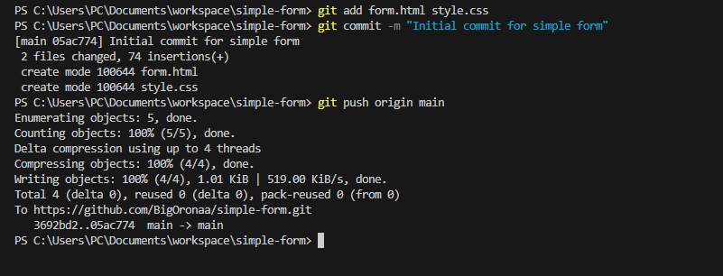  
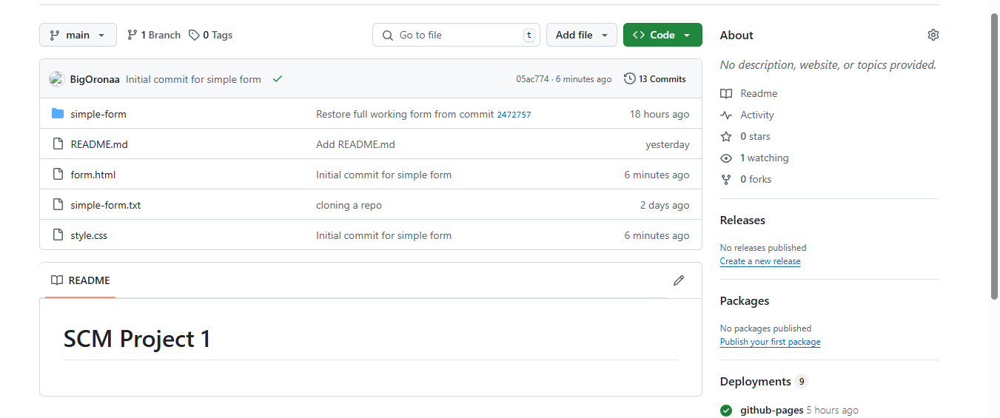


## Making and Tracking Changes

### 6. Add a Phone Number Field and Update Styles

- Edit `form.html` to include a phone number field.
- Modify `style.css` to update the form layout or appearance.

Then stage and commit the changes:

```bash
git add form.html style.css
git commit -m "Added phone number field and updated styles"
git push origin main
```

## Add images here
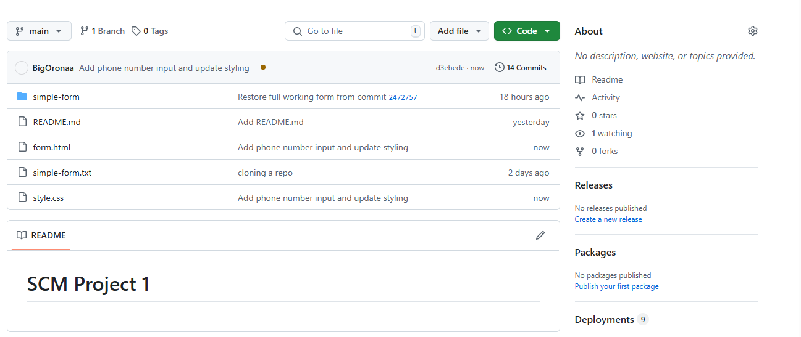  
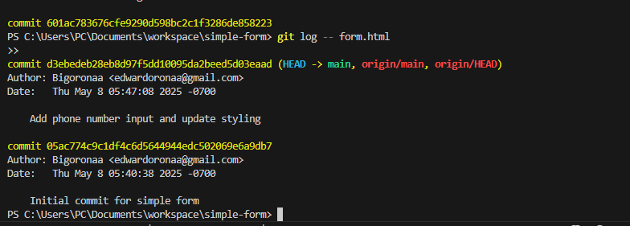
---

## View Commit History

```bash
git log
```

---

##  Revert to a Previous Working Version

If a bug is introduced, you can revert `form.html` to a previous version:

1. Run `git log` and find the hash of the last working commit.
2. Revert just the file with:

```bash
git checkout <commit-hash> -- form.html
```

3. Then commit and push:

```bash
git commit -am "Revert form.html to previous working version"
git push origin main
```


## Add images here
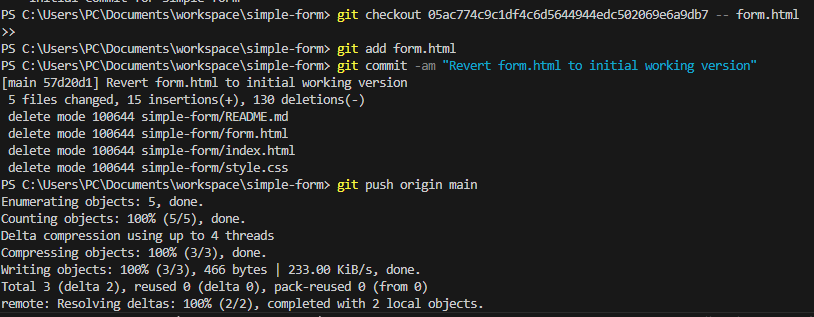 
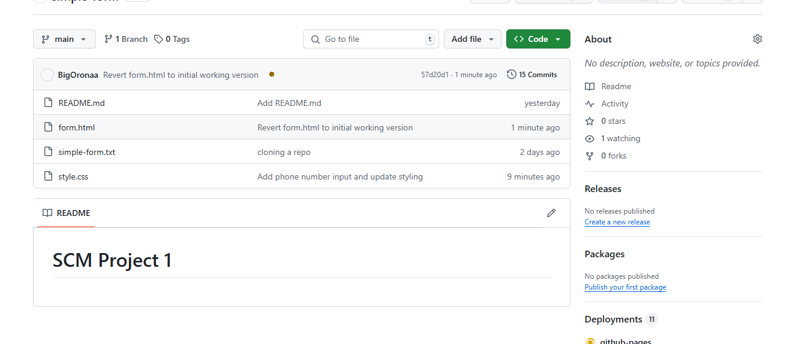


##  Add a CAPTCHA Feature (Branching)

### 1. Create and Switch to a New Branch

```bash
git checkout -b feature-add-captcha
```

### 2. Add CAPTCHA to `form.html`

> (For example, a simple math question using JavaScript.)

### 3. Stage and Commit CAPTCHA Changes

```bash
git add form.html
git commit -m "Added CAPTCHA feature"
```

## Add Images here
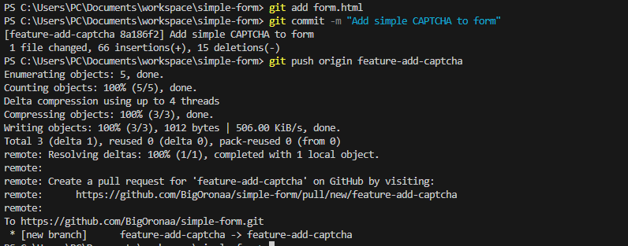


##  Merge CAPTCHA Branch into Main

```bash
git checkout main
git merge feature-add-captcha
```

## Add images here
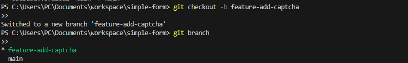  
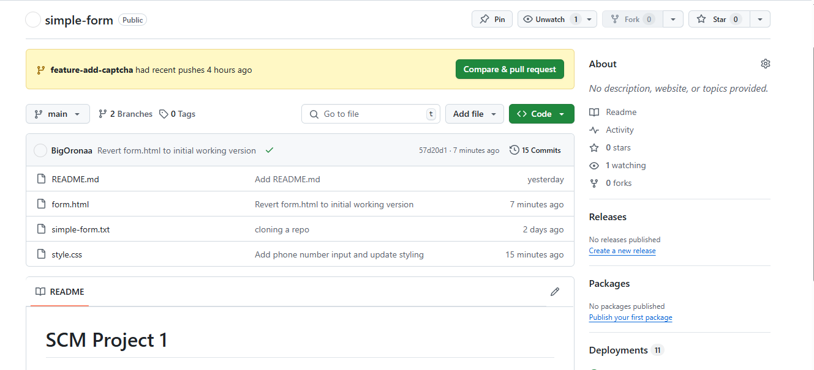

##  Push Merged Changes to GitHub

```bash
git push origin main
```

## Add images here
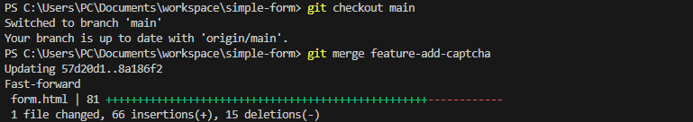
---

## Undo Uncommitted Changes (Local Only)

If you made unwanted changes to `style.css` and haven't committed yet:

```bash
git checkout -- style.css
```
## Add images here
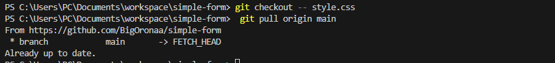

---

## Summary of Git Commands

```bash
git clone <repo-url>
git add <file>
git commit -m "message"
git push origin main
git log
git checkout <commit> -- <file>
git checkout -b <branch-name>
git merge <branch-name>
```


---

