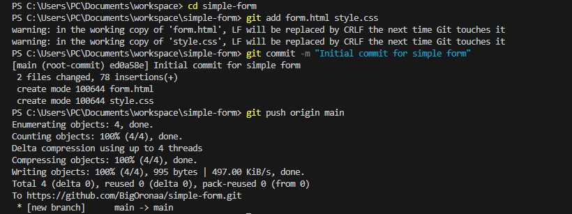
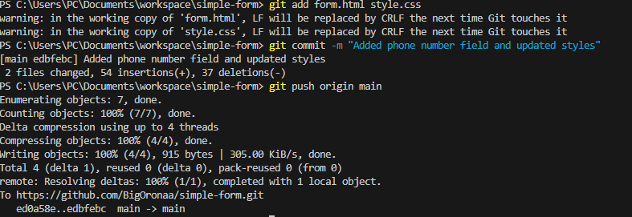
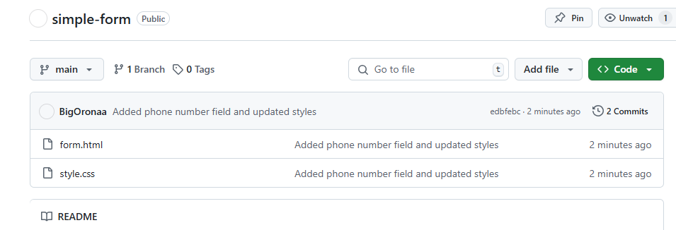
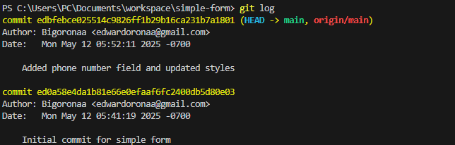
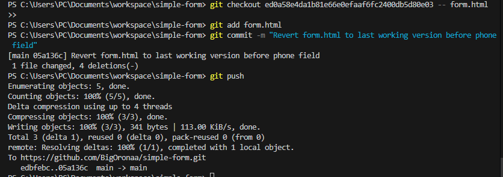
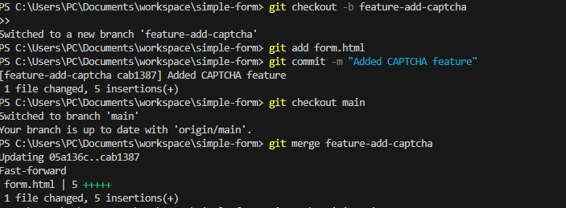
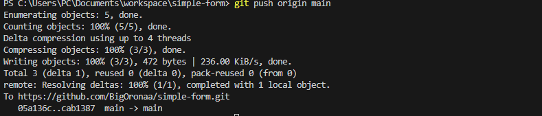

# Hands-on Lab: Using Git to Track and Manage Changes for a Simple Form

This is project a simple form project for a basic HTML contact form that collects user details like **name**, **email**, **message**, and optionally a **phone number** and a **CAPTCHA**. Below is a step-by-step log of how I built and tracked this project using Git and GitHub.

---

##  Prerequisites

Before starting, I made sure I had the following:
- Git installed on my machine
- A GitHub account with a repository named [`simple-form`](https://github.com/BigOronaa/simple-form)
- A basic understanding of Git commands
- Two local files: `form.html` and `style.css`

---

##  I started with: Clone the GitHub Repository:

### 1. I Cloned My Repository

```bash
git clone https://github.com/BigOronaa/simple-form.git
cd simple-form
```

---

### 2. I Added My Form Files

I copied `form.html` and `style.css` into the `simple-form` folder.

---

### 3. I Staged the Files

```bash
git add form.html style.css
```

---

### 4. I Committed the Initial Version

```bash
git commit -m "Initial commit for simple form"
```

---

### 5. I Pushed Everything to GitHub

```bash
git push origin main
```

---

## I Added Screenshots

> Screenshots related to my project will appear here:



---

##  I Made and Tracked Changes

### I Added a Phone Number Field and Updated Styles

I edited `form.html` to include a phone number input and tweaked the layout using `style.css`.

Then I staged and committed the changes:

```bash
git add form.html style.css
git commit -m "Added phone number field and updated styles"
git push origin main
```

---

### I Viewed the Commit History

```bash
git log
```

Screenshots:

  
  


---

##  I Reverted `form.html` to a Previous Version

1. I ran `git log` to find the commit hash I wanted to revert to.
2. I checked out the earlier version of the file:

```bash
git checkout <commit-hash> -- form.html
```

3. Then I committed and pushed the change:

```bash
git commit -am "Revert form.html to previous working version"
git push origin main
```

Screenshot:



---

##  I Added a CAPTCHA Feature (Using Branching)

### 1. I Created and Switched to a New Branch

```bash
git checkout -b feature-add-captcha
```

### 2. I Added CAPTCHA to `form.html`

> I used a basic CAPTCHA method like a math question with JavaScript.

### 3. I Staged and Committed My CAPTCHA Changes

```bash
git add form.html
git commit -m "Added CAPTCHA feature"
```

---

##  I Merged My CAPTCHA Branch into Main

```bash
git checkout main
git merge feature-add-captcha
```

Then I pushed the merged changes:

```bash
git push origin main
```

Screenshots:

  


---

##  I Undid Local Changes to `style.css`

When I made changes I didn’t want and hadn’t committed yet, I ran:

```bash
git checkout -- style.css
```

---

## list of  Git Command Summary that i used for this project

```bash
git clone <repo-url>
git add <file>
git commit -m "message"
git push origin main
git log
git checkout <commit> -- <file>
git checkout -b <branch-name>
git merge <branch-name>
```

---
